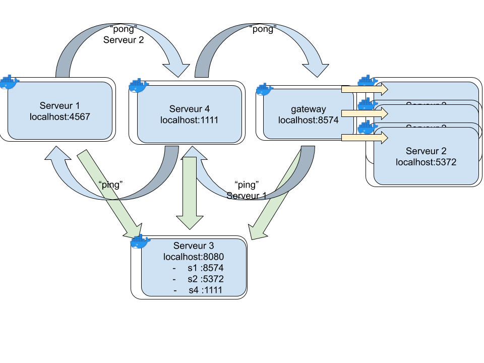

# Data pipeline between microservices
- Goals:



- Implementation: See file `docker-compose.yml` for more details. Make sure you have install Docker, then in root folder run:
```
docker-compose up
```

